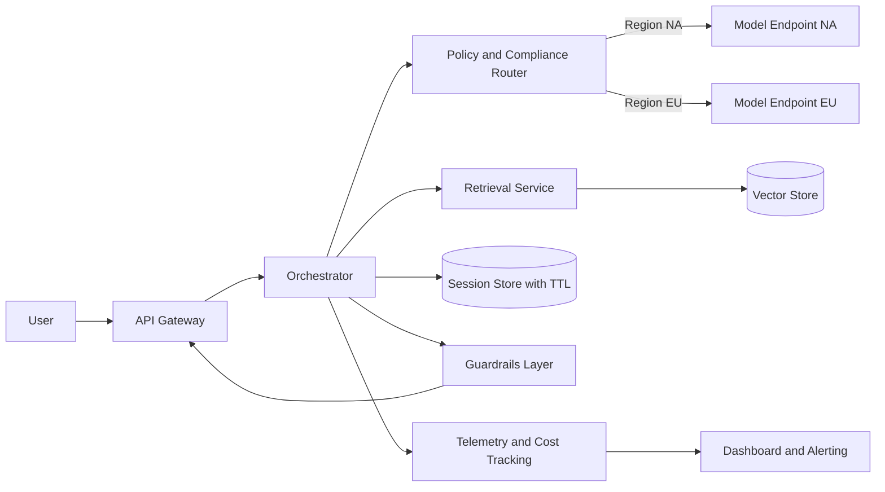
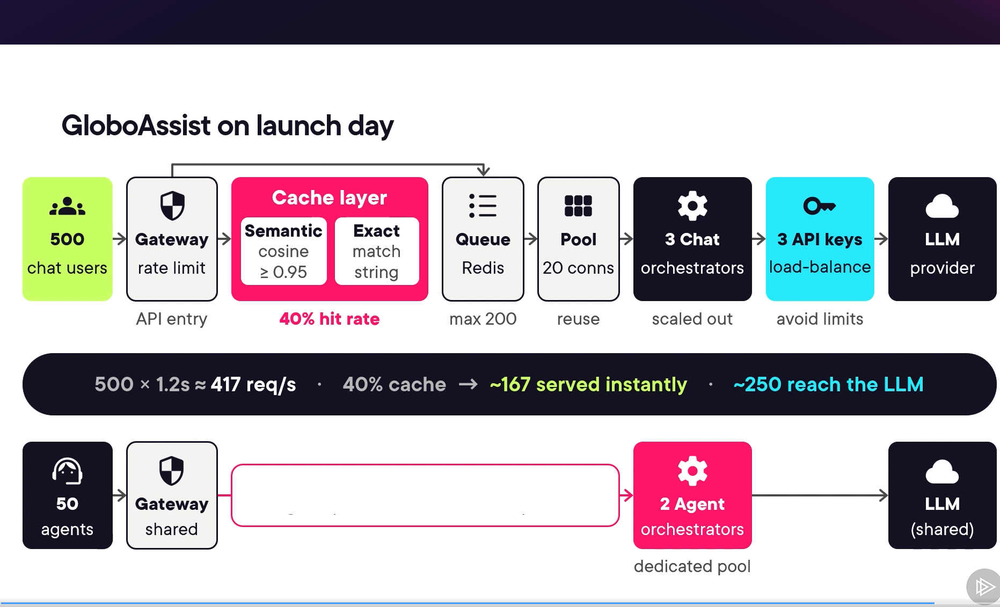
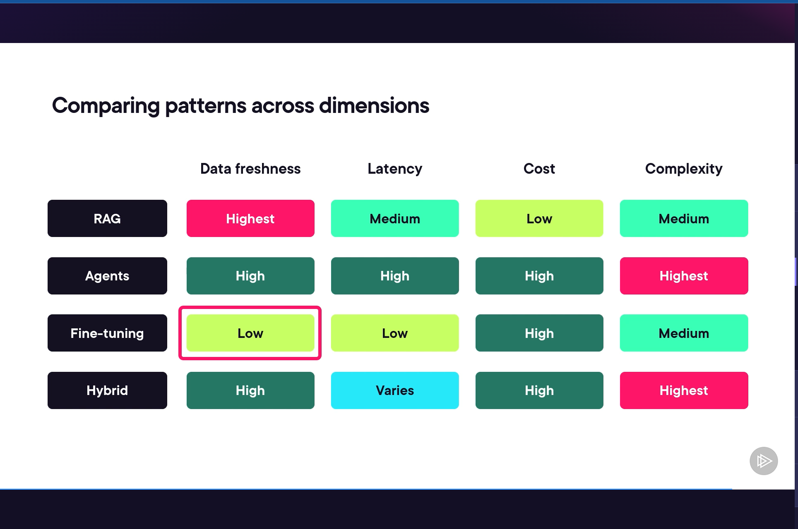

# GenAI System Architecture — Study Guide

> **Last Updated:** 2026-07-05 | Source: GenAI System Architecture Overview (Pluralsight) + MCP Knowledge Base

---

## HOW TO USE THIS GUIDE

This guide follows the **exact 5-module structure** of the course transcript you shared (22 topics).
Use it as your primary study reference — every section maps to a real transcript chapter.

| When | What to do |
|---|---|
| First study session | Read Module 1 fully, draw the canonical diagram from memory |
| Before interview | Skim Module quick-reference tables + Interview Answers section |
| Building artefacts | Use Module 5 templates + 7-day build plan |

---

## MODULE 1 — Understanding Core GenAI System Components

> Topics: Course intro · Anatomy of a production system · How layers interact · Tracing requests · Key decision points

---

### 1.1 The Scenario (Memorise These 5 Facts)

> "GloboAssist is a GenAI support platform for an e-commerce company with 50,000+ products, serving NA and EU customers, handling ~2,000 tickets/month. Today agents manually search a knowledge base — average handle time is **12 minutes**."

| | |
|---|---|
| Company | Mid-size e-commerce |
| Products | 50,000+ |
| Regions | North America + Europe (GDPR applies) |
| Support load | ~2,000 tickets/month |
| Pain point | 12-min handle time, manual KB lookup |

**Three workloads:** Real-time customer chat · Internal agent copilot · Batch analytics

---

### 1.2 Why MVP Breaks (and Which Layer Fixes Each)

| Problem in MVP | Root Cause | Layer That Fixes It |
|---|---|---|
| Hallucinated product specs | No real data access | **Data layer** — retrieval + vector store |
| Can't answer "where is my order?" | No tool routing | **Orchestration layer** — intent routing to order DB |
| Loses context between turns | No session memory | **Data + Serving** — external session store + TTL |
| Generic agent tone | No prompt or model tuning | **Orchestration** — system prompt + optional fine-tuning |

> **One-liner:** "The model isn't the problem. The stack around it is."

---

### 1.3 The Four Layers (Learn This Order)

```
SERVING       →  API gateway, auth, rate limits, streaming, observability
ORCHESTRATION →  Intent classify, retrieval, prompt assembly, guardrails, tool calls
DATA          →  Vector DB, order DB, CRM, session store (Redis)
MODEL         →  LLM inference, embeddings
```

Each layer has an **independent scaling strategy** — never scale all four the same way.

---

### 1.4 The Canonical Architecture

> Memorise this diagram. Redraw it from memory in under 5 minutes.



```text
If Mermaid doesn't render:

User → API Gateway → Orchestrator
                         ├─ Policy/Compliance Router → Model NA  /  Model EU
                         ├─ Retrieval Service → Vector Store
                         ├─ Session Store (TTL)
                         ├─ Guardrails Layer → API Gateway
                         └─ Telemetry → Dashboard
```

**Two planes to name explicitly in interviews:**

| Plane | What lives here |
|---|---|
| **Control plane** | Policy routing · authz · tool allowlists · schema contracts |
| **Data plane** | Retrieval · model inference · session persistence · response |

---

### 1.5 How the Layers Interact (Interface Contracts)

Each layer boundary needs a defined contract — otherwise it's just a monolith with extra files.

| Interface | What crosses it |
|---|---|
| Serving → Orchestration | user message + session ID + metadata |
| Orchestration → Data | query embedding + top_k + filters → ranked chunks |
| Orchestration → Model | system prompt + retrieved context + tool definitions → generated text |
| Data → Model (indexing only) | raw documents → embeddings (direct, not through orchestration) |

> **Key insight:** Orchestration doesn't care if data is in a vector DB, SQL DB, or external API — it depends on the *interface*, not the implementation.

---

### 1.6 Tracing Requests — Three Workload Paths

> **Core insight:** Same four layers. Different dominant constraint per workload.

| | **Customer Chat** | **Agent Copilot** | **Analytics Batch** |
|---|---|---|---|
| **Processing** | Synchronous | Synchronous multi-source | Asynchronous queue |
| **Flow** | gateway → intent classify → vector search → LLM → output guardrail → stream | gateway → parallel retrieve (CRM + order + KB) → LLM → structured JSON | scheduler → queue → batch workers → LLM summarise → aggregate → storage |
| **Bottleneck** | Model inference (~800ms) | Retrieval fan-out | Cost per ticket |
| **Optimise for** | p95 latency < 2 sec | Answer quality | Cost efficiency |
| **Pattern** | RAG + guardrails | Agentic + RAG + fine-tune (tone) | Batch summarisation |
| **Approx latency** | ~1.2 sec total | ~2.1 sec total | ~15 min (batch) |
| **State** | External session store (Redis) + TTL | Ticket context per interaction | Stateless |

---

### 1.7 Three Foundational Decisions (State These First in Any Design)

| Decision | GloboAssist Choice | Why |
|---|---|---|
| **Sync vs async** | Chat + copilot = sync · Analytics = async queue | A person is waiting for chat; batch has no SLA |
| **Stateless vs stateful** | Orchestrator stateless · State in Redis | Enables horizontal scaling without sticky sessions |
| **Monolith vs microservices** | Modular monolith first → extract retrieval + analytics workers later | Only split when a component has genuinely different scaling needs |

---

## MODULE 2 — Evaluating Architectural Patterns and Trade-offs

> Topics: Comparing patterns · Evaluating trade-offs · Model hosting strategies · Systematic decision framework

---

### 2.1 Pattern Selection Matrix

| Pattern | Data Freshness | Latency | Cost | Complexity | Best for |
|---|---|---|---|---|---|
| **RAG** | ✅ Highest | Medium | Low | Medium | Frequently changing knowledge |
| **Agents** | High | High | High | Highest | Multi-step, tool-driven workflows |
| **Fine-tuning** | Low | ✅ Low | High | Medium | Fixed style, tone, domain terminology |
| **Hybrid** | High | Varies | High | Highest | Multi-workload platforms |

> **GloboAssist uses all three:** RAG for chat · Agents+RAG for copilot · Batch RAG for analytics

**Don't pick one pattern for everything.** Pick the right pattern per workload.

---

### 2.2 The Trade-off Triangle

Every architectural choice moves you toward one vertex and away from the others:

```
         ACCURACY
           /\
          /  \
         /    \
     LATENCY -- COST
```

**4-step framework to use on every decision:**

```
1. Define minimum acceptable threshold for each dimension
2. Identify the primary dimension for your workload
3. Optimise that dimension while keeping the others above threshold
4. Measure and iterate
```

| Workload | Primary dimension | Threshold examples |
|---|---|---|
| Customer chat | Latency | p95 < 2 sec, accuracy > 85%, cost < $1K/month |
| Agent copilot | Accuracy | bad suggestions destroy agent trust |
| Analytics | Cost | cost per ticket must fit batch budget |

> **Interview line:** "There is no perfect architecture — only choices. The framework is what makes those choices defensible."

---

### 2.3 Model Hosting Strategies

| Strategy | Pros | Cons | When to choose |
|---|---|---|---|
| **Third-party API** (OpenAI, etc.) | Zero infra, fast to start | Data leaves your network, DPA risk | Non-regulated workloads, internal tools |
| **Self-hosted open source** (Gemma, Mistral) | Full data control, better unit economics at scale | GPU ops burden, VRAM planning required | Regulated data, high-volume batch |
| **Hybrid** | Best of both | Complexity of managing both | Multi-workload platforms with mixed compliance needs |

**GPU memory quick-reference:**
```
7B  model (FP16)  → ~14 GB VRAM minimum
70B model (FP16)  → ~140 GB VRAM (multi-GPU)
70B model (4-bit) → ~35-40 GB (single 80GB GPU, minor quality trade-off)
```

**GloboAssist hosting map:**
```
Chat NA      → Third-party API
Chat EU      → Self-hosted EU-West  (GDPR: PII never leaves EU)
Copilot      → Third-party API      (internal staff, DPA reviewed)
Analytics    → Self-hosted quantised (~$800/month vs $3,000 via API)
```

---

### 2.4 Systematic Decision Framework (4 Steps)

Use this when choosing any major component (vector DB, model, infra, etc.):

```
Step 1 — Constraints first
  Hard constraints: eliminate options outright (compliance, budget ceiling, existing infra)
  Soft preferences: nice-to-have (team familiarity, managed service, vendor)

Step 2 — Weighted decision matrix
  List at least 3 options (binary thinking misses the best middle path)
  Score each on: compliance · performance · cost · complexity · lock-in · scalability · time-to-implement

Step 3 — Trade-off and risk assessment
  What are you gaining? What are you giving up?
  What's the migration cost if you're wrong?

Step 4 — Stakeholder alignment + document as ADR
  Engineering: technical details
  Finance: cost delta
  Legal: compliance posture
  Product: timeline and user impact
```

**Example outcome — GloboAssist vector DB:**
Pgvector (76pts) beat Pinecone (72pts) and Qdrant (62pts) because compliance weight was highest and Pinecone's EU region didn't fit the residency budget at the time.

---

## MODULE 3 — Scaling and Optimizing GenAI Performance

> Topics: Horizontal/vertical scaling · Common bottlenecks · Concurrent user loads · KPIs and metrics

---

### 3.1 Scaling Strategy by Layer

> **Key rule:** Never apply the same scaling strategy to all four layers. Each has a different bottleneck.

| Layer | Scaling approach | Notes |
|---|---|---|
| **Data (vector DB)** | Vertical first (more RAM = index in memory) + read replicas | Shard by collection for large catalogs |
| **Model (self-hosted)** | Multiple GPU instances behind load balancer | If third-party, manage rate limits + connection pools |
| **Orchestration** | Horizontal (auto-scale instances) | Only works if kept **stateless** |
| **Analytics workers** | Separate worker pool from chat orchestrators | Prevents batch jobs from starving real-time traffic |

**GloboAssist at 10x scale:**
```
Before (1K queries/day):  1 orchestrator · 1 Postgres · 1 LLM connection
After  (10K+ + batch):    3 chat orchestrators behind LB · 2 Postgres read replicas ·
                          embedding service × 2 · Redis for sessions ·
                          Separate analytics worker pool (scales to 10 workers for batch)
```

---

### 3.2 Five Common Bottlenecks (and Fixes)

| # | Bottleneck | Symptoms | Fix |
|---|---|---|---|
| 1 | **Slow retrieval** | Retrieval > 30% of total latency | Tune HNSW index · add metadata pre-filtering · reduce top_k · cache embeddings |
| 2 | **Model inference latency** | Slow time-to-first-token | Route simple queries to smaller model · compress prompts · enable streaming · batch requests |
| 3 | **Context window overflow** | Model truncates or loses early context | Summarise history · selective retention · don't just buy bigger context window |
| 4 | **Network overhead** | Random latency spikes uncorrelated to traffic | Parallel API calls · connection pooling · co-locate orchestration with vector DB |
| 5 | **Architectural mismatch** | Timeouts on batch jobs | Move batch to async queue — this is not a perf fix, it's an architectural correction |

> **Key insight:** Bottleneck #5 is not fixed by tuning. It requires a design change.

---

### 3.3 Concurrency Strategies (Launch Day Design)

Four strategies to handle 500 concurrent users:

| Strategy | What it does | Key detail |
|---|---|---|
| **Connection pooling** | Reuse TCP/TLS connections across requests | Size = expected concurrency × avg request duration |
| **Request queuing** | Queue excess requests instead of dropping them | Redis sorted set · cap depth ~200 · 30-sec timeout = graceful eviction |
| **Multi-layer caching** | Absorb repeated questions | Exact match cache → semantic cache (cosine similarity ≥ 0.95) → embedding cache |
| **Load balancing** | Distribute across model instances or API keys | Least-connections or weighted round-robin |

**GloboAssist launch simulation:**



> **Reading the diagram:** 500 chat users hit the gateway → Cache layer absorbs 40% (semantic cosine ≥ 0.95 + exact match) → Queue (Redis, max 200) → Connection pool (20 conns, reuse) → 3 chat orchestrators (scaled out) → 3 API keys load-balanced to avoid rate limits → LLM.
> 500 × 1.2s ≈ 417 req/s · **~167 served instantly from cache** · **~250 reach the LLM**
> Agent copilot (50 agents) runs on a separate path → shared gateway → **2 dedicated agent orchestrators** → LLM (no cache — each query is unique context)

**Cache hit examples from the launch simulation:**

| Cache type | Query stored | Incoming query | Hit? | Why |
|---|---|---|---|---|
| Exact match | "What are your store hours?" | "What are your store hours?" | ✅ Yes | Identical string |
| Semantic | "When will the Globomantics Pro ship?" | "What's the shipping date for Globomantics Pro?" | ✅ Yes | Cosine similarity ≥ 0.95 |
| Semantic | "When will the Globomantics Pro ship?" | "Is the Globomantics Pro waterproof?" | ❌ No | Different intent, low similarity |
| Semantic | "What is the return policy?" | "How do I send something back?" | ✅ Yes | Same intent, different phrasing |
| Exact match | "What is the warranty on the new Globomantics Pro?" | "What is the warranty on the Globomantics Pro?" | ❌ No | Minor word diff fails exact match → falls through to semantic → ✅ hits |

> **Key insight:** Semantic cache handles phrasing variation. Exact cache handles repeated identical queries. Together they absorbed **35% + 5% = 40%** of launch traffic before it reached the LLM.

---

### 3.4 KPIs — Three Tiers to Track

| Tier | Metrics | Why |
|---|---|---|
| **User-facing** | p50, p95, p99 latency · time-to-first-token · error rate · availability | What users feel — SLA metrics |
| **System health** | Throughput (req/sec) · CPU/GPU utilisation · queue depth · **cache hit rate** | Early warning — cache hit drop predicts latency spike |
| **GenAI-specific** | Token usage/request · retrieval relevance scores · guardrail trigger rate · cost per query | Unique to AI — not in traditional dashboards |

> **Watch this signal:** If semantic cache hit rate drops from 40% → 10%, a latency spike is coming. The LLM is now absorbing load the cache was handling.

---

## MODULE 4 — Integrating and Designing APIs for GenAI Systems

> Topics: Clean API design · Enterprise integration patterns · Modular architecture · State management

---

### 4.1 Five API Design Rules

```
1. Streaming-first      — default for chat; non-streaming only when guardrail needs full output
2. Cancellation support — users rephrase mid-request; you pay per token for what nobody reads
3. Structured errors    — MODEL_TIMEOUT · CONTEXT_TOO_LONG · GUARDRAIL_BLOCKED (not just HTTP 500)
4. Abstraction balance  — hide prompt templates and retrieval details; expose temperature/max_tokens for power users
5. Graceful fallback    — keyword search when vector DB is unreachable; degrade, don't fail
```

**Three API patterns GloboAssist uses:**

| Endpoint | Pattern | Why |
|---|---|---|
| `POST /v1/chat` | Streaming SSE | Customer is watching tokens appear |
| `POST /v1/agent-assist` | Synchronous JSON | Agent console renders structured fields — streaming raw tokens doesn't work here |
| `POST /v1/analytics/reports` | Async job (returns job ID) | Batch — caller polls `GET /v1/analytics/reports/{id}` for result |

---

### 4.2 Enterprise Integration Patterns

**Four integration categories:**

| Category | Key rule |
|---|---|
| **Authentication** | Use existing IdP (OAuth2/OIDC) — don't build your own. Pass user context (role, scope) all the way to orchestration for data-level access control. |
| **Database access** | Read-only connections wherever possible. Never let LLM generate + execute raw SQL — use a thin parameterised query layer instead. |
| **Logging + compliance** | Log every interaction (input, model, latency, chunks retrieved, output). Send to append-only audit log. Redact PII before logging. Enable distributed tracing (request ID flows end-to-end). |
| **Monitoring** | Emit to existing Prometheus/Grafana stack. Add GenAI-specific alerts: guardrail trigger rate > 5%, cost per query spike. |

**Adapter pattern (keeps orchestrator decoupled):**
```python
# Orchestrator calls this — never knows which CRM is behind it
class DataAdapter:
    def query(self, resource_type, params) -> list: ...

class ZendeskAdapter(DataAdapter): ...   # maps Zendesk fields to internal format
class SalesforceAdapter(DataAdapter): ... # maps SOQL results to internal format
```

> **Rule:** Every external system gets an adapter. Swapping CRMs = new adapter only, zero orchestrator changes.

---

### 4.3 Modular Architecture — Three Pipeline Modules

> Layers describe *where* responsibilities live. Modules describe *what* each request-pipeline stage does.

| Module | Owns | Interface in | Interface out |
|---|---|---|---|
| **Retrieval** | Embedding generation · vector search · reranking | query + top_k + filters | list of documents with content + score |
| **Generation** | Prompt templates · model selection · LLM API call | messages + context + options | raw LLM response |
| **Post-processing** | Guardrails · PII redaction · citation extraction · formatting | raw response + safety policies | sanitised, safe response |

**Three testing levels for modules:**
```
Level 1 — Unit tests    : test each module in isolation with mocks
Level 2 — Contract tests: verify interface schema and SLA hold after internal changes
Level 3 — Integration   : full pipeline against test vector DB + test LLM (run less often)
```

> **Payoff:** When GloboAssist upgraded embedding model (ada-002 → 3-large), only the Retrieval module changed. Generation and Post-processing were never touched.

---

### 4.4 Managing State in Multi-Turn Conversations

**Four-part strategy:**

| Part | What to do |
|---|---|
| **Session storage** | Never store in orchestrator memory. Use Redis. Key = userId + sessionId. Set TTL. |
| **Context window management** | Fixed budget: system prompt (non-negotiable) + retrieved context (non-negotiable) + history (what's left) |
| **History truncation** | 3 strategies — sliding window (easy, loses early context), summarisation (preserves key facts, preferred), selective retention (most accurate, hardest) |
| **Session recovery** | On reconnect with session ID → rehydrate from Redis and continue. Guest sessions → delete at TTL. Auth sessions → retain 30 days with PII redacted. |

**Truncation strategy comparison:**

| Strategy | Token reduction | Retains key facts | Complexity |
|---|---|---|---|
| Sliding window | High | ❌ Loses early context | Low |
| Summarisation | ~92% compressed | ✅ Yes | Medium |
| Selective retention | Variable | ✅ Best | High |

> **Preferred default:** Summarise older turns with a cheap model. Keep recent turns intact.

---

## MODULE 5 — Documenting Architecture Decisions

> Topics: Architecture diagrams · C4 model demo · Sequence + data flow · ADRs · Roadmap + debt + stakeholder comms

---

### 5.1 Multi-Level Documentation (C4 Model)

Use **documentation as code** — Mermaid/PlantUML/Structurizr files stored in version control alongside application code.

| C4 Level | Audience | Shows |
|---|---|---|
| **L1 Context** | Everyone | System as a black box · users · external systems |
| **L2 Container** | Architects | Deployable units (apps, databases) and their communication |
| **L3 Component** | Developers | Components inside a single container |
| **L4 Code** | Developers | Class-level implementation (rarely used) |

> **Rule:** Each audience stops at the right zoom level. Executive stops at L1. Developer working on guardrails goes to L3.

**Also required:**
- Sequence diagrams — exact order of operations over time (who calls whom, when)
- Data-flow diagrams — how data transforms (where PII enters, where it's redacted, what hits the audit log)

---

### 5.2 Streaming vs Non-Streaming in Sequence Diagrams

| Approach | When to use | Risk |
|---|---|---|
| **Non-streaming** (wait → validate → respond) | Support chat, policy guidance, regulated output | Slower perceived UX — mitigate with progress indicator |
| **Optimistic streaming** (stream → retract if guardrail fails) | Creative writing, low-risk tools | User sees content before validation — retract UX is challenging |

> **GloboAssist chat uses non-streaming** — accuracy and safety matter more than tokens appearing word-by-word.

---

### 5.3 Architecture Decision Records (ADRs)

**ADR format:**

```
Title:          Short and descriptive
Status:         [ Proposed | Accepted | Deprecated | Superseded by ADR-00x ]
Date:
Context:        What situation or requirement drove this decision?
Decision:       What was chosen?
Alternatives:   Option A — strength · reason rejected
                Option B — strength · reason rejected
Consequences:   Positive: ___    Negative: ___
Trade-off:      We accept ___ in exchange for ___
Review triggers: Revisit if ___ exceeds ___
```

**Rules:**
- Never delete an ADR — mark old ones as **Superseded** and link to the new one
- Store as Markdown in version control (reviewable in PR diffs)
- Review triggers should be metric-based, not calendar-based

> **Interview line:** "ADRs make trade-offs explicit and defensible. Without them, teams re-debate settled decisions or undo them without knowing the original constraints."

**Example — GloboAssist ADR-003 (vector DB):**
```
Decision: Postgres + pgvector on existing RDS in us-east-1 and eu-west-1
Trade-off: Accept lower query perf at extreme scale in exchange for
           zero incremental cost + compliance control + team familiarity
Review trigger: Revisit if product count > 200,000 OR p95 retrieval > 200ms
```

---

### 5.4 Architecture Roadmap + Technical Debt + Stakeholder Communication

**Roadmap has three components:**
```
1. Current state  — what's built, known limitations
2. Target state   — where architecture should be in 6–12 months
3. Migration plan — small, independently deployable increments (prioritised by impact × risk)
```

**Debt register — categorise before prioritising:**

| Category | Meaning |
|---|---|
| **Deliberate** | Shortcut taken knowingly to ship fast |
| **Accidental** | Didn't realise it was suboptimal at the time |
| **Environmental** | Ecosystem changed, approach now outdated |

> **Prioritisation rule:** Impact × effort matrix. Fix high-impact low-effort items immediately. **Tie larger debt to roadmap work** — don't treat it as a separate sprint that never gets scheduled.

**Stakeholder communication — one change, three messages:**

| Audience | Frame |
|---|---|
| **Engineering RFC** | Technical details · sprint breakdown · rollback plan · test strategy |
| **Product brief** | What it unblocks · user impact (none during migration) · timeline |
| **Executive summary** | Investment ($200/month infra) · return ($400/month saving) · what we need (2 engineers × 3 weeks) |

> "If you can't translate architectural work into language each stakeholder cares about, you won't get the resources to do it."

---

## INTERVIEW QUICK REFERENCE

### Q: Design a compliant multi-region GenAI system

> "First I'd define the hard constraints — residency, retention, redaction. Then route by compliance policy before any model call — EU traffic stays in EU. Session state lives in a region-pinned store with TTL and audit tags. Guardrails run both before and after generation. Cost, latency, and policy-violation rates are first-class SLOs."

---

### Q: When do you disable streaming?

> "When the full response has to pass a guardrail before the user sees it — policy advice, legal text, high-risk workflow. For a creative assistant I'd stream optimistically and retract on fail. For support chat I hold the response, not the tokens."

---

### Q: What is an ADR and why does it matter?

> "A one-page document capturing a single architectural decision — context, decision, alternatives rejected, trade-offs accepted, and review triggers. It preserves *why* a decision was made under specific constraints. Without it, teams re-debate settled questions or undo decisions whose original reasons they no longer know."

---

### Q: How do you prioritise technical debt?

> "Categorise first — deliberate, accidental, or environmental. Score impact × effort. Fix high-impact low-effort items immediately. Tie larger debt items to planned roadmap work so they're not orphaned in a sprint that never happens."

---

### Q: Explain the same architectural change to three audiences

| Audience | Frame |
|---|---|
| **Engineering** | What changes · rollout steps · rollback plan · test strategy |
| **Product** | What it unblocks · user impact · timeline |
| **Executive** | Investment · return · risk · success metric in one line |

---

### Constraints Checklist (Run Before Every Design)

- [ ] Compliance — data residency, retention period, redaction needed?
- [ ] Latency — p95 target, time-to-first-token?
- [ ] Cost — per-request budget, retrieval fan-out limit?
- [ ] Reliability — fallback model, degraded-mode behaviour?
- [ ] Safety — pre-generation and post-generation guardrails?
- [ ] Operability — tracing, audit logs, SLO ownership?

---

## 7-DAY BUILD PLAN

| Day | Build | Pass Check |
|---|---|---|
| 1 | Constraint table for a support assistant | Can explain why one option fails compliance |
| 2 | C4 L1 context + L2 container diagrams | Every box has owner, data class, failure mode |
| 3 | Sequence (happy path + guardrail fail) + data-flow with PII checkpoint | Can point to where PII is blocked or redacted |
| 4 | Streaming decision matrix + rollback strategy for unsafe output | Can justify one mandatory non-streaming case |
| 5 | ADR-001 — vector store selection | At least 2 rejected alternatives with measurable trade-offs |
| 6 | 3-phase roadmap + debt register with categories | Each debt item has trigger + due-decision date |
| 7 | 12-min architecture pitch · 5-min trade-off deep dive · 3 audience versions | Can handle follow-up without changing core constraints |

---

## FILL-IN TEMPLATES

### ADR Template

```
Title:
Status:         [ Proposed | Accepted | Superseded by ADR-00x ]
Date:
Context:        What constraint or requirement drove this?
Decision:       What was chosen?
Alternatives:   Option A — rejected because ___
                Option B — rejected because ___
Consequences:   Positive: ___    Negative: ___
Trade-off:      We accept ___ in exchange for ___
Review trigger: Revisit if ___ exceeds ___
```

### Debt Register Row

```
Item:             ___
Type:             [ Deliberate | Accidental | Environmental ]
User impact:      ___
Eng impact:       ___
Risk if ignored:  ___
Fix:              ___
Owner + due:      ___
```

### Exec Summary (6 lines)

```
Problem:          ___
Decision:         ___
Business impact:  ___
Risk:             ___
Investment:       ___
Success metric:   ___
```

---

## READINESS GATE

You are ready when **all four** are true:

- [ ] Redraw canonical architecture from memory in < 5 minutes
- [ ] Name the dominant constraint for each of the 3 workloads without looking
- [ ] Explain one rejected design alternative and why it failed constraints
- [ ] Present the same system to engineering, product, and executive in different language

**If you can't do these yet:** Go back to Module 1 and redraw. Do not read more. Draw more.

---

## REFERENCE VISUAL



> "GloboAssist is a GenAI support platform for an e-commerce company with 50,000+ products, serving NA and EU customers, handling ~2,000 tickets/month. Today agents manually search a knowledge base — average handle time is **12 minutes**."

| | |
|---|---|
| Company | Mid-size e-commerce |
| Products | 50,000+ |
| Regions | North America + Europe (GDPR applies) |
| Support load | ~2,000 tickets/month |
| Pain point | 12-min handle time, manual KB lookup |

**Three workloads:** Real-time customer chat · Internal agent copilot · Batch analytics

---

### 1.2 Why MVP Breaks (and Which Layer Fixes Each)

| Problem in MVP | Root Cause | Layer That Fixes It |
|---|---|---|
| Hallucinated product specs | No real data access | **Data layer** — retrieval + vector store |
| Can't answer "where is my order?" | No tool routing | **Orchestration layer** — intent routing to order DB |
| Loses context between turns | No session memory | **Data + Serving** — external session store + TTL |
| Generic agent tone | No prompt or model tuning | **Orchestration** — system prompt + optional fine-tuning |

> **One-liner:** "The model isn't the problem. The stack around it is."

---

### 1.3 The Four Layers (Learn This Order)

```
SERVING       →  API gateway, auth, rate limits, streaming, observability
ORCHESTRATION →  Intent classify, retrieval, prompt assembly, guardrails, tool calls
DATA          →  Vector DB, order DB, CRM, session store (Redis)
MODEL         →  LLM inference, embeddings
```

Each layer has an **independent scaling strategy** — never scale all four the same way.

---

### 1.4 The Canonical Architecture

> Memorise this diagram. Redraw it from memory in under 5 minutes.


```text
If Mermaid doesn't render:

User → API Gateway → Orchestrator
                         ├─ Policy/Compliance Router → Model NA  /  Model EU
                         ├─ Retrieval Service → Vector Store
                         ├─ Session Store (TTL)
                         ├─ Guardrails Layer → API Gateway
                         └─ Telemetry → Dashboard
```

**Two planes to name explicitly in interviews:**

| Plane | What lives here |
|---|---|
| **Control plane** | Policy routing · authz · tool allowlists · schema contracts |
| **Data plane** | Retrieval · model inference · session persistence · response |


