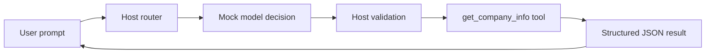

# Minimal MCP User Call POC

This project shows the host-side flow you asked about:

1. User enters a natural-language prompt.
2. Mock model sees system instruction and tool schema and decides on tool use.
3. Host validates tool decision and arguments against policy/schema.
4. Tool executes and returns structured JSON.

## Run

```bash
cd c:/Users/ankitjai/work/personal/03_ai_ml_engineering/mcp_examples/minimal_mcp_user_call_poc
python app.py
```

Example prompt:

```text
get me Teradata company info
```

## What this demonstrates

- Rule-based routing path (for comparison)
- More realistic LLM-style decision path with:
    - system instruction
    - tool schema list
    - confidence score
    - host-side validation before execution

## Realistic mock output shape

For supported requests:

```json
{
    "needs_clarification": false,
    "tool_used": "get_company_info",
    "confidence": 0.94,
    "result": {
        "found": true,
        "name": "Teradata",
        "industry": "Enterprise data and AI platform",
        "headquarters": "San Diego, California, USA",
        "core_products": ["Teradata Vantage", "AI Studio", "Enterprise Vector Store"]
    }
}
```

For ambiguous/unsupported requests:

```json
{
    "needs_clarification": true,
    "message": "I can help with company info requests like 'get me Teradata company info'.",
    "confidence": 0.41
}
```

## Flow diagram


